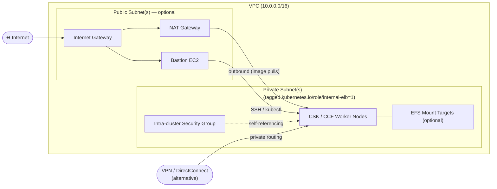

# AWS Network Infrastructure for CSK & CCF

Terraform root module that provisions the AWS VPC and networking prerequisites required to install **Cloudera Service for Kubernetes (CSK)** and **Cloudera Cloud Factory (CCF)**. It creates a production-ready private network topology that serves as the foundation for all subsequent CSK and CCF infrastructure.

> **Bastion host capability:** When enabled, the bastion is an Ubuntu 24.04 LTS EC2 instance that is fully provisioned via cloud-init as a CSK/CCF installer workstation. It comes pre-installed with **Docker, Ansible, OpenTofu, ORAS CLI, Flux CLI, kubectl, k9s**, and all other prerequisites — ready to use immediately after `terraform apply`.

---

## Features

| Feature | Description |
|---|---|
| **VPC** | Dedicated VPC with DNS hostnames and DNS resolution enabled |
| **Private subnets** | One or more private subnets tagged `kubernetes.io/role/internal-elb=1` as required by the AWS Load Balancer Controller |
| **Private route tables** | Per-subnet route tables; default routes via NAT Gateway when public subnets are present |
| **Intra-cluster security group** | Self-referencing security group for unrestricted pod-to-pod and node-to-node traffic within the cluster |
| **Public subnets** *(optional)* | Internet Gateway + public subnets for bastion host placement |
| **NAT Gateways** *(optional)* | One Elastic IP and NAT Gateway per public subnet for private subnet outbound internet access (container image pulls, etc.) |
| **Bastion host** *(optional)* | Ubuntu EC2 jump host pre-provisioned with Docker, Ansible, OpenTofu, ORAS CLI, Flux CLI, kubectl, k9s, and all other CSK installer prerequisites via cloud-init |
| **SSH key management** | Auto-generates an RSA 4096-bit key pair and saves the private key locally as `<prefix>-bastion-ssh-key.pem`, or accepts an existing key file |
| **EFS** *(optional)* | Encrypted EFS file system with mount targets in each private subnet and a dedicated NFS security group |
| **S3 bucket** *(optional)* | S3 bucket for cluster/CCF backups |
| **IAM user & policies** *(optional)* | Scoped IAM user with EC2, ELB, Route 53, S3, and IAM policies required by CCF/CSK; credentials exported to a local CSV |
| **Route 53 hosted zones** *(optional)* | Public and/or private hosted zones delegated from a parent zone |

---

## Architecture



**Two supported connectivity models:**

- **With VPN / DirectConnect:** Set `create_public_subnet = false`. Only private subnets are created; routing is handled externally. No public resources or NAT Gateways are provisioned.
- **Without VPN / DirectConnect:** Set `create_public_subnet = true`. Public subnets, Internet Gateway, NAT Gateways, and optionally a bastion host are created so the environment is reachable and private subnets have outbound internet access.

---

## Prerequisites

- Terraform `>= 1.3` (or OpenTofu `>= 1.6`)
- AWS credentials configured in the environment (`AWS_ACCESS_KEY_ID` / `AWS_SECRET_ACCESS_KEY`, an IAM role, or an SSO profile)
- Permissions to create VPCs, subnets, route tables, security groups, Internet Gateways, NAT Gateways, Elastic IPs, EC2 instances, key pairs, EFS, S3, IAM resources, and Route 53 zones in the target AWS account

---

## Usage

### 1. Copy and edit the variables file

```bash
cp terraform.tfvars.sample terraform.tfvars
```

Edit `terraform.tfvars` with your environment-specific values (see [Input Variables](#input-variables) below).

### 2. Initialise and apply

```bash
terraform init
terraform plan
terraform apply
```

### 3. Use the outputs in CSK / CCF installation

After `apply`, note the key outputs:

```bash
terraform output vpc_id
terraform output private_subnets
terraform output intra_cluster_security_group
terraform output bastion_ip          # when create_bastion = true
```

These values are passed as inputs to the CSK cluster-manager (`csk-cluster-manager`) and the CCF installer (`ccf-install`).

---

## Input Variables

### Required

| Variable | Type | Description |
|---|---|---|
| `prefix` | `string` | Deployment prefix for all resources (4–10 characters) |
| `aws_region` | `string` | AWS region to deploy into (e.g. `us-east-1`) |

### General

| Variable | Type | Default | Description |
|---|---|---|---|
| `owner` | `string` | `coe-pse-apac` | Owner tag applied to all resources |

### VPC

| Variable | Type | Default | Description |
|---|---|---|---|
| `vpc_cidr` | `string` | `10.0.0.0/16` | VPC CIDR block |
| `vpc_name` | `string` | `<prefix>-csk-vpc` | Override the VPC name |

### Private Networking

| Variable | Type | Default | Description |
|---|---|---|---|
| `private_subnets` | `list(object)` | Single `/24` in first AZ | List of private subnets (`name`, `cidr`, `az`, `tags`). Specify multiple for HA. |
| `private_subnet_name` | `string` | `<prefix>-csk-private` | Name prefix for auto-generated private subnets |
| `private_route_table_name` | `string` | `<prefix>-csk-private` | Name prefix for private route tables |
| `security_group_intra_name` | `string` | `<prefix>-csk-intra` | Name for the intra-cluster security group |

### Public Networking *(optional)*

| Variable | Type | Default | Description |
|---|---|---|---|
| `create_public_subnet` | `bool` | `false` | Set `true` when no VPN or DirectConnect is available |
| `public_subnets` | `list(object)` | Single `/24` in first AZ | List of public subnets (`name`, `cidr`, `az`, `tags`) |
| `public_subnet_name` | `string` | `<prefix>-csk-public` | Name prefix for auto-generated public subnets |
| `public_route_table_name` | `string` | `<prefix>-csk-public` | Name prefix for public route tables |
| `nat_gateway_name` | `string` | `<prefix>-csk-nat` | Name prefix for NAT Gateways |

### Bastion Host *(optional, requires `create_public_subnet = true`)*

| Variable | Type | Default | Description |
|---|---|---|---|
| `create_bastion` | `bool` | `false` | Create a bastion jump host |
| `bastion_instance_type` | `string` | `t3.medium` | EC2 instance type |
| `bastion_image_name` | `string` | `ubuntu/images/hvm-ssd-gp3/ubuntu-noble-24.04-amd64-server-*` | AMI name pattern (wildcards supported) |
| `bastion_image_owner` | `string` | `099720109477` (Canonical) | AWS account ID owning the AMI |
| `bastion_ssh_private_key_file` | `string` | `null` | Path to existing SSH private key; `null` auto-generates a new RSA 4096-bit key |
| `bastion_ssh_allowed_cidrs` | `list(string)` | `[]` | CIDRs allowed to reach the bastion on port 22 |

### S3 Bucket *(optional)*

| Variable | Type | Default | Description |
|---|---|---|---|
| `create_s3_bucket` | `bool` | `false` | Create an S3 bucket for cluster/CCF backups |
| `s3_bucket_name` | `string` | `""` | Suffix for the S3 bucket name (`ccf-<prefix>-<name>`). Required when `create_s3_bucket = true`. |

### IAM *(optional)*

| Variable | Type | Default | Description |
|---|---|---|---|
| `create_iam_user` | `bool` | `false` | Create a scoped IAM user (`<prefix>-csk-ccf-awc-restricted`) and export credentials to a local CSV |
| `create_iam_policies` | `bool` | `false` | Create and attach EC2, ELB, Route 53, S3, and IAM policies to the IAM user |

### EFS *(optional)*

| Variable | Type | Default | Description |
|---|---|---|---|
| `create_efs` | `bool` | `false` | Create an encrypted EFS file system with mount targets in every private subnet |

### Route 53 Hosted Zones *(optional)*

| Variable | Type | Default | Description |
|---|---|---|---|
| `parent_hosted_zone` | `string` | `clouderapartners.click` | Existing parent public hosted zone to delegate from |
| `create_public_hosted_zone` | `bool` | `true` | Create a public hosted zone `<prefix>.<parent_hosted_zone>` and add NS records to the parent zone |
| `create_private_hosted_zone` | `bool` | `true` | Create a private hosted zone `<prefix>.<parent_hosted_zone>` associated with the VPC |

---

## Outputs

| Output | Description |
|---|---|
| `vpc_id` | VPC ID |
| `vpc_cidr` | VPC CIDR block |
| `availability_zones` | Availability zones data source |
| `public_subnets` | Public subnet objects (empty when `create_public_subnet = false`) |
| `private_subnets` | Private subnet objects (tagged `kubernetes.io/role/internal-elb=1`) |
| `intra_cluster_security_group` | Intra-cluster security group object |
| `bastion_ip` | Routable IP of the bastion host (empty when `create_bastion = false`) |

---

## Bastion Host

When `create_bastion = true`, an Ubuntu 24.04 LTS EC2 instance is launched in the first public subnet. The `files/bastion-csk-installer-prereqs.sh` cloud-init script automatically installs the following tools:

- **Docker** CE (with the `ubuntu` user added to the `docker` group)
- **Ansible Core** `2.17.8` in a shared Python venv at `/opt/csk-venv` (group `csk`, permissions `2774`)
- **Ansible Collections**: `ansible.posix`, `ansible.utils`, `ansible.netcommon`, `community.general`, `kubernetes.core`, `community.kubernetes`
- **OpenTofu** `1.6.2`
- **ORAS CLI** `1.2.0`
- **Flux CLI** (latest via official install script)
- **kubectl** `1.30` (from the Kubernetes apt repository)
- **k9s** (latest release)

The venv is auto-activated for the `ubuntu` user on login via `~/.bashrc`.

Terraform waits for cloud-init to complete (up to 15 minutes) before marking the bastion as ready. SSH using the generated key:

```bash
ssh -i <prefix>-bastion-ssh-key.pem ubuntu@$(terraform output -raw bastion_ip)
```

---

## IAM Resources

When `create_iam_user = true` and `create_iam_policies = true`, the module creates:

- An IAM user `<prefix>-csk-ccf-awc-restricted` with an access key
- A local credentials CSV file `<prefix>-iam-credentials.csv` (permissions `0600`)
- Three IAM policies attached to the user:
  - **`ccf-restricted-<prefix>-policy`** — scoped EC2, ELB, pricing, and IAM permissions required by CCF/CSK
  - **`ccf-route53-<prefix>-policy`** — Route 53 permissions for the created hosted zones
  - **`ccf-s3-backup-<prefix>-policy`** — S3 list/read/write/delete on the created bucket

> **Warning:** The generated `<prefix>-iam-credentials.csv` file contains sensitive AWS credentials. Do **not** commit it to version control. It is excluded by `.gitignore`.

---

## Route 53 Hosted Zones

| Zone | Condition | Name | Notes |
|---|---|---|---|
| Public | `create_public_hosted_zone = true` | `<prefix>.<parent_hosted_zone>` | NS delegation records added to the parent zone automatically |
| Private | `create_private_hosted_zone = true` | `<prefix>.<parent_hosted_zone>` | Associated with the VPC; resolves only within the VPC |

---

## Example: `terraform.tfvars` for a full deployment

```hcl
prefix     = "csk01"
aws_region = "us-east-1"
owner      = "my-team"
vpc_cidr   = "10.0.0.0/16"

create_public_subnet = true

private_subnets = [
  { name = "csk01-csk-private-01", cidr = "10.0.1.0/24", az = "us-east-1a", tags = {} },
  { name = "csk01-csk-private-02", cidr = "10.0.2.0/24", az = "us-east-1b", tags = {} },
]

create_bastion               = true
bastion_ssh_private_key_file = null               # auto-generate
bastion_ssh_allowed_cidrs    = ["203.0.113.10/32"]

create_s3_bucket = true
s3_bucket_name   = "cluster-backup"

create_iam_user     = true
create_iam_policies = true

create_efs = true

parent_hosted_zone         = "clouderapartners.click"
create_public_hosted_zone  = true
create_private_hosted_zone = true
```

---

## Provider Requirements

| Provider | Version |
|---|---|
| `hashicorp/aws` | `>= 5.0.0` |
| `hashicorp/tls` | `>= 4.0` |
| `hashicorp/local` | `>= 2.4` |
| `hashicorp/null` | `>= 3.0` |

---

## Authors

- **Kuldeep Sahu** (<ksahu@cloudera.com>)
- **Yash Gulati** (<ygulati@cloudera.com>)

*Additional credits to **Jim Enright** (<jenright@cloudera.com>) for baseline code and lots of ideas.*

---

## License

Copyright 2025 Cloudera, Inc. Licensed under the [Apache License, Version 2.0](https://www.apache.org/licenses/LICENSE-2.0).
